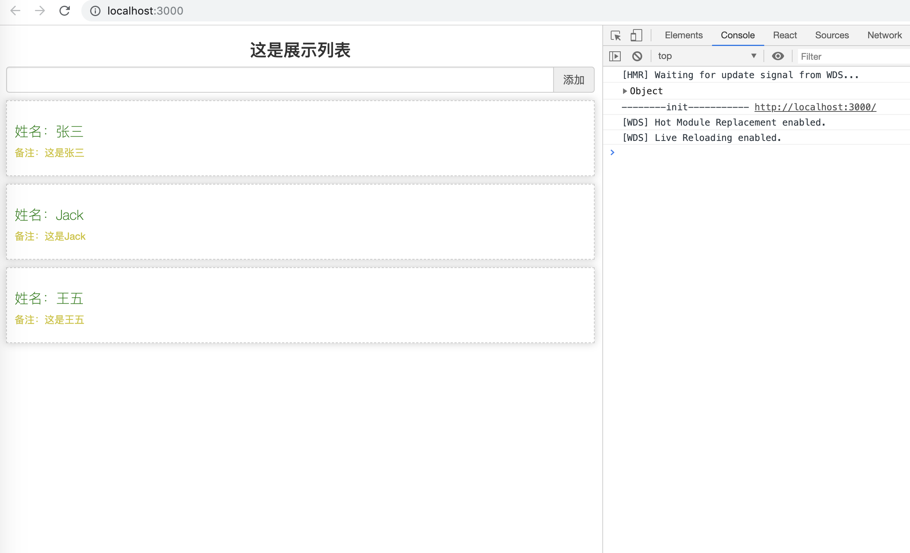

# 从0开始学习React

视频：[最全的react视频【黑马程序员】](https://www.bilibili.com/video/av37668737)

笔记：[Github地址](https://github.com/harryleexyz/LearnReact/blob/master/base/README.md)     [Gitee地址](https://gitee.com/harryleexyz/LearnReact/blob/master/base/README.md)

进入目录后运行：

```bash
npm install -g cnpm 
cnpm insatll
cnpm run dev
```

效果图：

