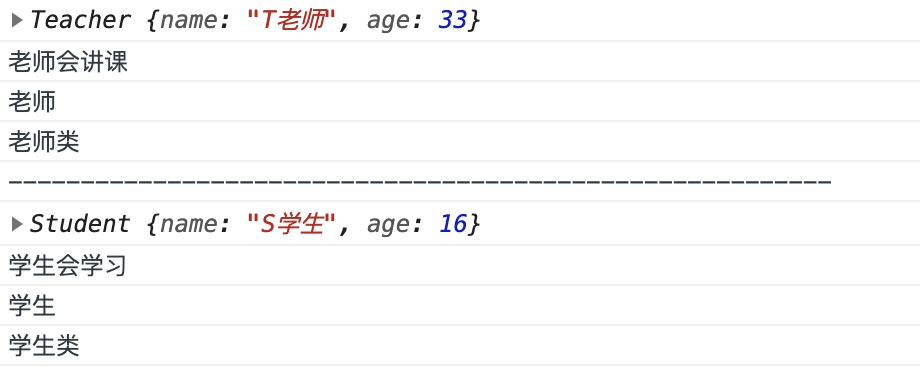
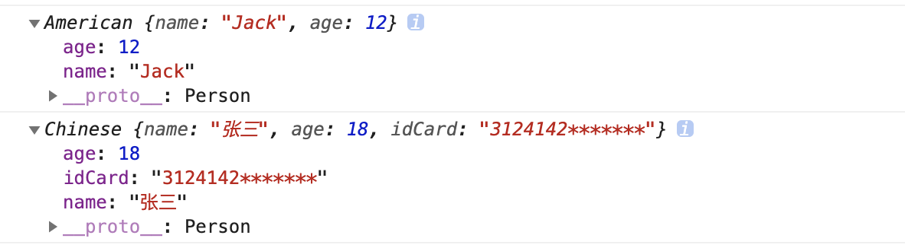
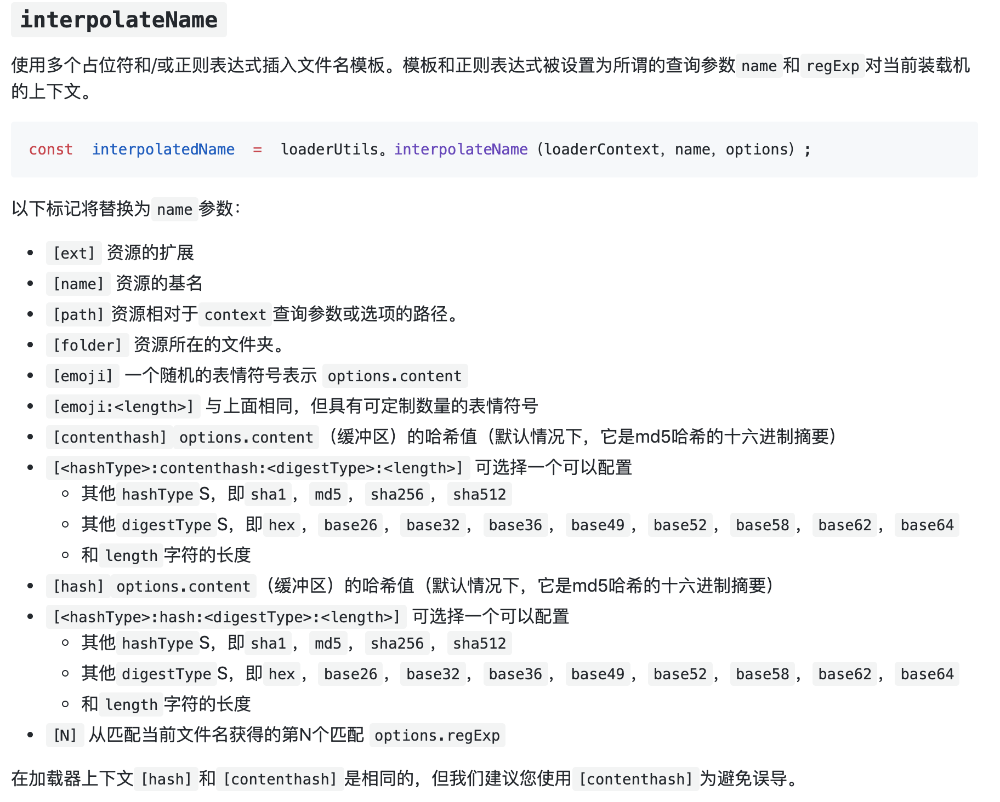

# React 基础学习

```bash
npm init -y # 初始化一个项目，生成 package.json
mkdir dist src # 新建项目文件夹
cnpm install webpack webpack-cli -D # 在目录安装webpack
# sudo npm install cnpm -g 安装cnpm
# 新建 src/index.js webpack.config.js
cnpm install webpack-dev-server -D # 安装小型服务器
# 作用：webpack-dev-server 在内存中新建了一个main.js，作为项目的实时编译结果
# 命令："dev": "webpack-dev-server --open --port 3000 --hot --progress --compress"
# 配置 package.json -> "scripts" -> "dev"
npm run dev
cnpm install html-webpack-plugin -D # 新的插件
# 作用：把 index.html 也托管到内存中去，并且帮我们把生成的也追加到 index.html 

```


# 开始使用React 

```bash
cnpm install react react-dom -S # 安装react
# 作用：react 创建组件和虚拟DOM，同时管理组件的生命周期
#      react-dom 渲染组件到页面
```

```js

# 第一步
import React from "react"
import ReactDOM from "react-dom"

# 第二步
// React 创建组件，创建DOM，管理生命周期
// 参数1：DOM名称
// 参数2：属性
// 参数3：子节点
const myH1 = React.createElement("h1", {
    title: '这是我的H1',
    id: "myH1"
}, "这是一个H1");

# 第三步
// ReactDOM 渲染DOM
// 参数1：DOM
// 参数2：容器
ReactDOM.render(myH1, document.getElementById("app"));

# 容器
<div id="app"></div>
```


# 使用babel

```bash
cnpm install babel-loader @babel/core @babel/plugin-transform-runtime -D # 插件
cnpm install @babel/preset-env @babel/preset-react -D # 转换语法
```

`.babelrc`

```json
{
  "presets": [ "@babel/preset-env", "@babel/preset-react" ],
  "plugins": [ "@babel/plugin-transform-runtime" ]
}
```

`webpack.config.js`

```js
module.exports = {
    ...
    module: { // 第三方模块的配置规则
        rules: [
            {test: /\.js|jsx$/, use: 'babel-loader', exclude: /node_modules/}
        ]
    }
};
```

# JSX 语法

- 本质：把HTML标记语言，转换为createElement 形式再渲染；
- 定义：一种 JavaScript 的语法扩展，但比HTML要严格的XML语法；

## `{}`

- 什么情况下使用？需要把JS中变量放入JSX语法中时。

## Warning: Each child in a list should have a unique "key" prop.

- 报错原因: 没有给循环控制的元素绑定唯一
- 导致会出现的错误: 会无法保存循环行的状态
- 解决办法: 给循环直接控制的元素，增加key，即最外层的元素增加key

```js
ReactDOM.render(<div>
    {arrStr.map(item => <div key={item}><h1>{item}</h1></div>)}
</div>, document.getElementById("app"));
```


# 创建组件的第一种方式：function 关键字

- 方法就是组件

```jsx
function Hello(pops) {
    return <h1>{pops.name} -- {pops.age}</h1>
}
const dog = {
    name: "小黄",
    age: 5
};
 <Hello {...dog}/>
```

- 单独分离文件
- `src/components/Hello.jsx`

```jsx
import React from 'react'
export default function Hello(pops) {
    return <h1>{pops.name} -- {pops.age}</h1>
};
// export default Hello;
```

- `src/index.js` 使用时，需要引入

```jsx
import Hello from "./components/Hello" // "./components/Hello.jsx"
```

# 自动补全后缀配置

```json
// webpack.config.js
module.exports = {
    ...
    resolve: { // 自动补全后缀配置，此处默认[".js", ".json"]
        extensions: [".js", ".jsx", ".json"]
    }
};
```

# 配置@符号别名

```jsx
// import Hello from "@/components/Hello"
const path = require('path');
module.exports = {
   ...
    resolve: {
       ...
        alias: { // 之后使用 @ 符号就是 /src
            "@": path.join(__dirname, './src'),
        }
    }
};
```

# Class关键字的使用

- 原理：`class` 关键字只是babel提供的语法糖，内部实现还是ES5

```js
function Teacher(name, age) {
    this.name = name;
    this.age = age;
}

const teacher = new Teacher("T老师", 33);
Teacher.prototype.say = function () {
    console.log("老师会讲课");
};

Teacher.info = "老师";
Teacher.print = function () {
    console.log("老师类")
};
console.log(teacher);
teacher.say();
console.log(Teacher.info);
Teacher.print();

console.log("---------------------------------------------------------");


// class 报错安装: npm install @babel/runtime -D
class Student {
    constructor(name, age) {
        this.name = name;
        this.age = age;
    }

    learn() {
        console.log("学生会学习");
    }
    static info = "学生"; // 静态属性报错安装: npm install @babel/plugin-proposal-class-properties -D 并在 .babelrc -> plugins 启用
    static print() {
        console.log("学生类")
    }
}

const student = new Student("S学生", 16);

console.log(student);
student.learn();
console.log(Student.info);
Student.print();
```

`.babelrc`

```json
{
  ...
  "plugins": ["@babel/plugin-proposal-class-properties"]
}
```




- 注意1：class { } 区间内只能写构造器、静态属性、静态方法、实例方法
- 注意2：class 关键字是被babel转换的，内部实现还是function，本质没有变，所以class 其实是语法糖

## Class 的继承 extends

```js
// 使用 extends 实现继承关系
class Person {
    constructor(name, age){
        this.name = name;
        this.age = age;
    }
}
class American extends Person{
}
class Chinese extends Person{
    constructor(name, age, idCard){
        super(name, age); // 注意super只能放在第一行
        this.idCard = idCard;
    }
}
const am = new American("Jack",12);
console.log(am);

const ch = new Chinese("张三",18,"3124142*******");
console.log(ch);
```



# 创建组件的第二种方式：class 关键字

- `src/components/SayHello.jsx`

```jsx
import React from 'react'

export default class SayHello extends React.Component {
    constructor() {
        super();
        this.state = {
            color: "小黄是黄色毛发"
        };
    }

    render() {
        // 注意1: 继承React.Component 组件必须要有render 函数
        // 注意2: 继承render 函数必须要有返回值，如果是空组件也要返回null
        // return null;
        // 注意3: 继承React.Component 组件 使用参数用 this.props 就可以直接获取
        // 注意4: this.props里的元素是只读的
        // this.props.name = "小黑"; //Uncaught TypeError: Cannot assign to read only property 'name' of object '#<Object>'
        // 注意5: 继承React.Component 组件 有自己的状态
        // 注意6: this.state 里面的值是可读可写的
        this.state.color = "小黑是黑色毛发";
        return <h1>{this.props.name} -- {this.props.age} -- {this.state.color}</h1>
    }
}

// export default SayHello;
```

- 使用

```js
// 第二种方式：使用class关键字创建组件 并 extends React.Component
...
import SayHello from "@/components/SayHello"
ReactDOM.render(<div>
   ...
    <SayHello {...dog}/>
</div>, document.getElementById("app"));
```

# 展示列表应用

## 数据

```json
data: [
  {id: 1, name: "张三", remark: "这是张三"},
  {id: 2, name: "Jack", remark: "这是Jack"},
  {id: 3, name: "王五", remark: "这是王五"}
]
```

## 展示控件`Grid`

```jsx
import React from 'react'
// 使用 @ 符号可以避免路径问题
// import GridRow from "./GridRow"
import GridRow from "@/components/GridRow"

export default class Grid extends React.Component {
    constructor() {
        super();
        this.state = {
            data: [...]
        }
    }

    render() {
        return <div>
            <h1>这是展示列表</h1>
            {this.state.data.map(item => <GridRow key={item.id} {...item} />)}
        </div>
    }
}
```

## 内容控件`GridRow`

```jsx
import React from "react";
import style from "@/css/styles"

export default function GridRow(props) {
    return <div className={"row"}>
    <h1 style={{color: "green", fontWeight: 300, fontSize: 18}}>姓名：{props.name}</h1>
    <p style={{fontSize: 13}}>备注：{props.remark}</p>
   </div>
}
```

## 抽离样式

```jsx
...

// 第一层封装：样式为单独的变量
// const nameStyle = {color: "green", fontWeight: 300, fontSize: 18};
// const remarkStyle = {fontSize: 13};

// 第二层封装：整合到一个变量
const styles = {
    name: {color: "green", fontWeight: 300, fontSize: 18},
    remark: {fontSize: 13}
};


export default function GridRow(props) {
    return <div className={"row"}>
    <h1 style={styles.name}>姓名：{props.name}</h1>
    <p style={styles.remark}>备注：{props.remark}</p>
    </div>
    // return <div><h1 style={nameStyle}>姓名：{props.name}</h1>
    //<p style={remarkStyle}>备注：{props.remark}</p></div>
}
```

## 抽离到单独的文件`src/css/styles.css`

```css
/*
报错：Uncaught Error: Module parse failed: Unexpected token
引入：cnpm install style-loader css-loader -D
// webpack.config.js
module.exports = {
    ...
    module: { // 第三方模块的配置规则
        rules: [
            ...
            {test: /\.css$/, use: ['style-loader', 'css-loader']} // css 配置
        ]
    },
    resolve: {
        // 自动补全后缀配置，此处默认[".js", ".json"]
        extensions: [... ".css"], // 一般使用不要不全css，以便区分
    }
};
 */
.title {
    text-align: center;
    font-size: 22px;
}

.row {
    border: 1px dashed #ccc;
    margin: 10px;
    padding: 10px;
    box-shadow: 0 0 10px #ccc;
}
```

## 使用单独的样式文件

```jsx
...
// 第三层封装：抽离为单独的css文件
import style from "@/css/styles.css"
console.log(style); // {}
// 注意1：在没有配置样式的模块化时，样式是回应用到所有的文件这里打印的是 {}

export default class Grid extends React.Component {
    ...
    render() {
        return ...
            <h1 className="title">这是展示列表</h1>
            ...
    }
}

```

```jsx
...
import style from "@/css/styles"
...
export default function GridRow(props) {
    return <div className={"row"}>...</div>
}
```

## 配置style的模块化

- `webpack.config.js`

```jsx
module: { // 第三方模块的配置规则
   rules: [
     ...
     // 注意1：模块化后css中的class选择器和id选择器会被模块化
     // 注意2：HTML标签选择器不会被模块化
     {... use: [...'css-loader?modules']} // css 配置
   ]
}
```
- `Grid.jsx`

```jsx
...
// 第三层封装：抽离为单独的css文件
import style from "@/css/styles.css"
console.log(style); // {}
// 注意1：在没有配置样式的模块化时，样式是回应用到所有的文件这里打印的是 {}
// 在设置完css的模块化后打印：{title: "_1_SjtDCiFqhB0kvNkh5p4F", row: "_2l2aNIbX7fS85a_GqUoFqm"}

export default class Grid extends React.Component {
   ...
    render() {
        return <div>
            <h1 className={style.title}>这是展示列表</h1>
          	...
        </div>
    }
}
```
- `GridRow.jsx`

```jsx
...
import style from "@/css/styles"

export default function GridRow(props) {
    return <div className={style.row}>
    ...
    </div>
}
```

- 自定义模块化后生成的样式名称 [localIdentName 的配置说明](https://github.com/webpack/loader-utils#interpolatename)

```jsx
module: { // 第三方模块的配置规则
    rules: [
      ...
      // localIdentName 的配置说明：https://github.com/webpack/loader-utils#interpolatename
      {... use: [...'css-loader?modules&localIdentName=[path][name]-[local]-[hash:6]']} 
   ]
}
```



- 不让css模块化，即全局生效的css

```css
/*
:global: 表示全局，那么不会被模块化
:local: 默认
 */

:global(.all){
    color: #ccc423;
}
```

```jsx
...
import style from "@/css/styles"
...
export default function GridRow(props) {
    return ...<p style={styles.remark} className={"all"}>备注：{props.remark}</p>...
}
```

# 项目中使用Bootstrap

- `Grid.jsx`
```jsx
// 注意1：导入 node_modules 模块时可以省略目录，因为会先去找
// 注意2：导入后回报错 无法处理字体，需要导入url-loader并配置
// ./node_modules/_bootstrap@3.3.7@bootstrap/dist/fonts/glyphicons-halflings-regular.ttf 1:0
// cnpm install url-loader file-loader -D

import "bootstrap/dist/css/bootstrap.css"
/*
项目中使用bootstrap
安装：cnpm install bootstrap@3.3.7 -S
问题1：这时 引入的其他的css 也会被模块话，使用很不方便，怎么处理
    答案：想办法不处理引入的css
解决方法1：直接排除 node_modules ？ 不行报错
解决方法2：既然引入的都是css文件，那么我就用一种新的文件 less or scss
安装：cnpm install sass-loader node-sass -D
1.更改自己的css文件名称为.scss
2.webpack.config.js增加处理器
*/
export default class Grid extends React.Component {
   ...
    render() {
        return <div>
           ...
            <button className={"btn btn-primary"}>添加</button>
           ...
        </div>
    }
}

```
- `webpack.config.js`
```js

...
module.exports = {
  	...
    module: { // 第三方模块的配置规则
        rules: [
            {test: /\.css$/, use: ['style-loader', 'css-loader']}, // css 配置
            {test: /\.ttf|woff2|woff|eot|svg$/, use: 'url-loader'}, // 图标文件处理
            {test: /\.scss$/, use: ['style-loader', 'css-loader?modules&localIdentName=[path][name]-[local]-[hash:6]', 'sass-loader']} //自己的文件处理器
        ]
    },
    ...
};
```

# React绑定事件

- 注意1：标签上的事件名称驼峰命名，如：onClick，事件只接收一个function
- 注意2：箭头函数的使用

```jsx
...

export default class Grid extends React.Component {
   ...
    render() {
        return <div>
           ...
            <button ... onClick={() => {this.print()}}>添加</button>
           ...
        </div>
    }
    print = () => {
        console.log("Hello 添加")
    }
}
```

- 注意3：修改私有数据state 推荐使用`this.setState({});`

# React中State设置值和获取

```jsx
print = () => {
        console.log("Hello 添加");
        // 注意1：在React中给this.state赋值，要使用this.setState({}); 不然页面不刷新
        // this.state.data.push( {id: 4, name: "赵六", remark: "这是赵六"});

        // 注意2：setState 只会修改传入的或者新增的state 不会删除
        // 注意3：setState 是异步的，要拿到最新的，可以使用第二个参数，回调this.setState({},callback)

        this.setState({
            data: this.state.data.concat({
                id: this.state.data.length + 1,
                name: "我是" + this.state.data.length,
                remark: "这是" + this.state.data.length
            })
        }, () => console.log(this.state.data))
    }
```

# React中获取页面上的元素

```jsx
...

export default class Grid extends React.Component {
    constructor() {
        super();
        this.state = {
          ...
            txtVal: ""
        }
    }
    render() {
        return <div>
          ...
            <div className="input-group" style={{ margin :'0 10px 0 10px'}}>
                <input type="text" className="form-control" ref="txt" onChange={(e)=> this.txtChange(e)}/>
                    <span className="input-group-addon" onClick={() => {this.print()}} >添加</span>
            </div>
          ...
        </div>
    }
    print = () => {
       ...
        // 注意4：若想获取页面上的元素有2种办法，第一种 refs ,第二种 e.target
        // const newVal = this.refs.txt.value;
        // console.log(this.refs);

        const newVal = this.state.txtVal;
        this.setState({
            data: [...this.state.data, {
                id: this.state.data.length + 1,
                name: "我是" + newVal,
                remark: "这是" + newVal
            }]
        }, () => console.log(this.state.data))
    }

    txtChange = (e) => {
        this.setState({
            txtVal: e.target.value
        });
    }
}

//#region 测试代码块 用户自己的折叠代码块

//#endregion
```

